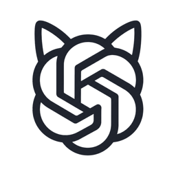
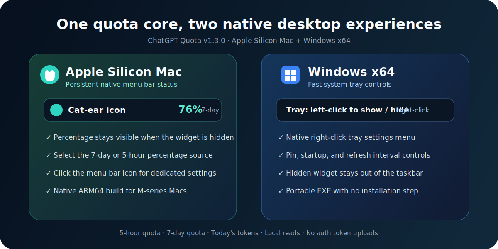

# ChatGPT Quota

<p align="center">
  <a href="README.md">中文说明</a> | English README
</p>

<p align="center">
  
</p>

<p align="center">
  <br />
  <strong>A compact Windows and Apple Silicon Mac widget for monitoring your local Codex quota.</strong><br />
  It adds a persistent percentage to the Mac menu bar, fast Windows tray controls, and a compact desktop quota panel.
</p>

<p align="center">
  <a href="#release-download">Release Download</a> ·
  <a href="#features">Features</a> ·
  <a href="#privacy-and-security">Privacy</a> ·
  <a href="#development">Development</a>
</p>

## Release Download

The latest stable release is `v1.4.1`, with Windows and Apple Silicon Mac packages in the same GitHub Release:

[Download ChatGPT Quota v1.4.1](https://github.com/1nuYasha-cck/codex-quota-widget/releases/tag/v1.4.1)

Download the Windows portable `.exe`, or download `mac-arm64.zip` for an Apple Silicon Mac. Windows is unsigned and the Mac bundle only has an ad-hoc local-execution signature; neither build has a trusted commercial code signature, so the operating system may require manual approval on first launch.

## Overview

ChatGPT Quota reads quota snapshots from your locally installed Codex application and presents them in a small floating desktop widget. It is designed for Windows and Apple Silicon Mac users who want quick visibility into remaining Codex usage without keeping the full Codex app in focus.

The project is inspired by the desktop-widget idea in `xicunwus2025-sys/codex-led-widget`, but the repository identity, README content, visuals, Codex path handling, and privacy notes have been rewritten for this project.

## Preview

<p align="center">
  
</p>

## Mac and Windows Features

<p align="center">
  
</p>

| Platform | Platform-specific experience | Release format |
| --- | --- | --- |
| Apple Silicon Mac | Menu bar icon and remaining percentage; switchable 7-day/5-hour source; compact `216×390` settings popover; menu bar stays active after the widget is closed and the Dock icon hides automatically | ARM64 `.zip` containing the `.app` |
| Windows x64 | Left-click tray toggle; native right-click settings menu; always-on-top, startup, and refresh interval controls; no installer required | Portable `.exe` |

### Mac

- Keeps the app icon and selected remaining percentage visible in the menu bar.
- Lets the menu bar percentage follow either the 7-day or 5-hour quota and remembers the choice.
- Opens a dedicated settings popover from the menu bar icon.
- Closing the floating widget hides it while the menu bar process remains active, and automatically hides the Dock icon in the background.
- Uses a compact `216×390` menu-bar settings popover with scaled-down controls still available.
- Ships as a native Apple Silicon ARM64 build for M-series Macs.

### Windows

- Left-clicking the system tray icon shows or hides the floating widget.
- Right-clicking opens the native tray menu for refresh, pinning, startup, and refresh interval settings.
- Ships as a portable x64 executable with no installation step.
- Keeps the widget out of the taskbar and continues running from the tray when hidden.

## Features

- Lets you independently show or hide the 5-hour quota, 7-day quota, and liquid meter.
- Lets the liquid meter follow either quota window and remembers the selection.
- Displays the current plan type, such as `PLUS`.
- Reads today's token usage from local `.codex/sessions` logs.
- Supports always-on-top mode, tray hiding, startup launch, and configurable refresh intervals.
- Supports free edge resizing and remembers the last window size.
- Scales the meter, cards, controls, spacing, and type together with the window.
- Keeps only More, Hide, and Quit in the title bar; refresh, pin, language, and display controls live in the More menu.
- Uses consistent quota thresholds: emerald `#34C98F` at 40% or above, amber `#F2B84B` from 20% to 39%, and coral `#FF5C5C` below 20%. Loading and read failures only affect the read-status indicator.

## Local Codex Path

The widget prefers the current local Codex installation:

```txt
%LOCALAPPDATA%\OpenAI\Codex\bin\<version-hash>\codex.exe
```

The widget tries the current Codex Desktop installation first, then global npm, pnpm, Bun, and `PATH` CLI installations.

## Privacy and Security

- No Codex token input is required.
- Authentication tokens are not read, saved, printed, or uploaded.
- `.env`, `.codex`, logs, caches, build outputs, and local credential files are excluded from Git.
- Quota reads use your existing local Codex sign-in state.
- Today's token summary only reads usage fields from local session logs.

## Installation

Install dependencies:

```bash
npm install
```

Run in development mode:

```bash
npm run dev
```

Build the Windows portable executable:

```bash
npm run build
```

The output executable is generated at:

```txt
dist/ChatGPT-Quota-1.4.1-win-x64.exe
```

Build the Apple Silicon Mac package on macOS:

```bash
npm run build:mac
```

The app is generated at `dist/mac-arm64/ChatGPT Quota.app`. The Apple Silicon bundle receives an ad-hoc signature for local ARM64 execution; this is not an Apple Developer ID signature. Create the release ZIP with `ditto -c -k --sequesterRsrc --keepParent`.

## Development

```bash
git clone https://github.com/1nuYasha-cck/codex-quota-widget.git
cd codex-quota-widget
npm install
npm run dev
```

Useful commands:

| Command | Purpose |
| --- | --- |
| `npm run dev` | Start Electron in development mode |
| `npm start` | Start the app |
| `npm run build` | Build the Windows portable exe |
| `npm run build:dir` | Generate the unpacked Windows app directory |
| `npm run build:mac` | Build the Apple Silicon Mac ARM64 app |

## License

MIT License
