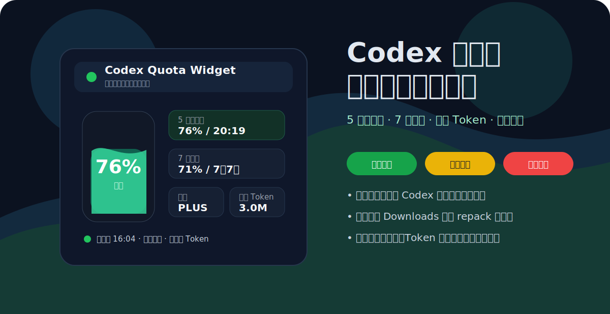
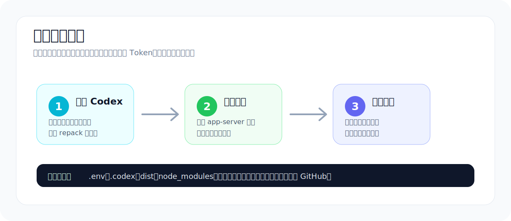

# Codex Quota Widget

<p align="center">
  <a href="README.md">中文说明</a> | English README
</p>

<p align="center">
  
</p>

<p align="center">
  <strong>A compact Windows and Apple Silicon Mac widget for monitoring your local Codex quota.</strong><br />
  It keeps the 5-hour quota, 7-day quota, and today's token usage visible in a small desktop panel.
</p>

<p align="center">
  <a href="#release-download">Release Download</a> ·
  <a href="#features">Features</a> ·
  <a href="#privacy-and-security">Privacy</a> ·
  <a href="#development">Development</a>
</p>

## Release Download

The latest stable release is `v1.2.0`, with Windows and Apple Silicon Mac packages in the same GitHub Release:

[Download Codex Quota Widget v1.2.0](https://github.com/1nuYasha-cck/codex-quota-widget/releases/tag/v1.2.0)

Download the Windows portable `.exe`, or download `mac-arm64.zip` for an Apple Silicon Mac. Both builds are currently unsigned, so the operating system may require manual approval on first launch.

## Overview

Codex Quota Widget reads quota snapshots from your locally installed Codex application and presents them in a small floating desktop widget. It is designed for Windows users who want quick visibility into remaining Codex usage without keeping the full Codex app in focus.

The project is inspired by the desktop-widget idea in `xicunwus2025-sys/codex-led-widget`, but the repository identity, README content, visuals, Codex path handling, and privacy notes have been rewritten for this project.

## Preview

<p align="center">
  
</p>

## Features

- Lets you independently show or hide the 5-hour quota, 7-day quota, and liquid meter.
- Lets the liquid meter follow either quota window and remembers the selection.
- Displays the current plan type, such as `PLUS`.
- Reads today's token usage from local `.codex/sessions` logs.
- Supports always-on-top mode, tray hiding, startup launch, and configurable refresh intervals.
- Supports free edge resizing and remembers the last window size.
- Scales the meter, cards, controls, spacing, and type together with the window.
- Keeps only More, Hide, and Quit in the title bar; refresh, pin, language, and display controls live in the More menu.
- Uses clear meter thresholds: green at 40% or above, orange below 40%, red below 20%, and blue while loading.

## Local Codex Path

The widget prefers the current local Codex installation:

```txt
%LOCALAPPDATA%\OpenAI\Codex\bin\<version-hash>\codex.exe
```

The widget tries the current Codex Desktop installation first, then global npm, pnpm, Bun, and `PATH` CLI installations.

## Privacy and Security

- No Codex token input is required.
- Authentication tokens are not read, saved, printed, or uploaded.
- `.env`, `.codex`, logs, caches, build outputs, and local credential files are excluded from Git.
- Quota reads use your existing local Codex sign-in state.
- Today's token summary only reads usage fields from local session logs.

## Installation

Install dependencies:

```bash
npm install
```

Run in development mode:

```bash
npm run dev
```

Build the Windows portable executable:

```bash
npm run build
```

The output executable is generated at:

```txt
dist/Codex-Quota-Widget-1.2.0-win-x64.exe
```

Build the Apple Silicon Mac package on macOS:

```bash
npm run build:mac
```

The app is generated under `dist/Codex Quota Widget-darwin-arm64/`.

## Development

```bash
git clone https://github.com/1nuYasha-cck/codex-quota-widget.git
cd codex-quota-widget
npm install
npm run dev
```

Useful commands:

| Command | Purpose |
| --- | --- |
| `npm run dev` | Start Electron in development mode |
| `npm start` | Start the app |
| `npm run build` | Build the Windows portable exe |
| `npm run build:dir` | Generate the unpacked Windows app directory |
| `npm run build:mac` | Build the Apple Silicon Mac ARM64 app |

## License

MIT License
