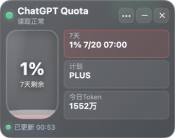
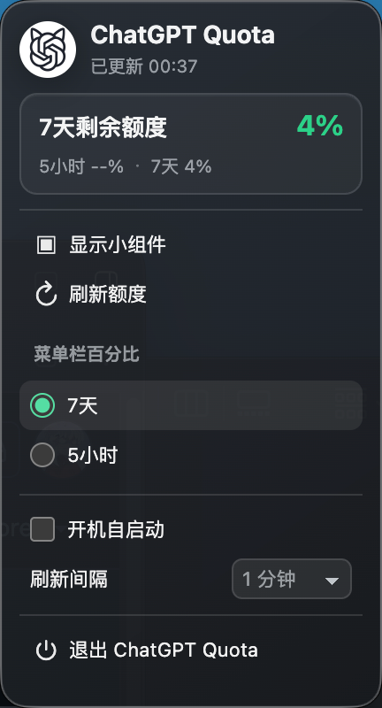
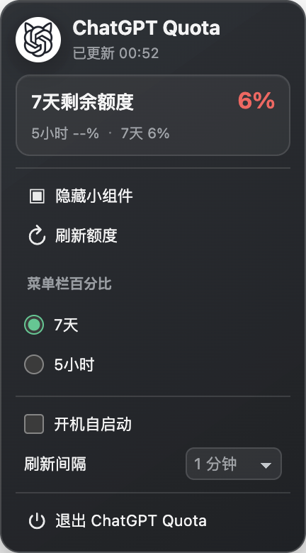

# ChatGPT Quota 开发与问题报告

## 1. 产品概览

ChatGPT Quota 是一个跨平台 Electron 桌面工具，用于读取本机 Codex 已登录账号的额度快照，并展示 5 小时额度、7 天额度、重置时间、计划类型和当日 Token 统计。应用不要求用户输入认证 Token，也不把额度数据上传到远端。

当前发布目标：

- Windows x64：免安装 Portable EXE，使用托盘进行显示、隐藏和设置。
- Apple Silicon Mac：ARM64 APP/ZIP，菜单栏常驻显示额度百分比，并提供紧凑设置面板。

## 2. 技术栈

| 层级 | 技术 | 作用 |
| --- | --- | --- |
| 桌面运行时 | Electron 43 | 提供主进程、无边框窗口、托盘、菜单栏窗口和 IPC |
| 语言 | JavaScript（CommonJS） | 主进程、额度服务、界面逻辑和测试 |
| 界面 | HTML / CSS | 透明悬浮窗、液体水位、额度卡片和 Mac 菜单栏面板 |
| 数据读取 | 本机 Codex CLI / ChatGPT 内置 Codex | 复用本机登录态读取额度，不接触认证 Token |
| 本地统计 | Codex session 日志 | 汇总当天 Token 使用量 |
| 构建 | electron-builder 26 | 生成 Windows Portable 和 macOS ARM64 应用包 |
| Mac 启动签名 | macOS `codesign` ad-hoc | 让未使用 Developer ID 的 ARM64 应用包可以稳定本地启动 |
| 测试 | Node.js `node:test` | 覆盖额度换算、平台逻辑、窗口尺寸和打包约束 |
| 发布 | GitHub CLI + GitHub Releases | 托管源码、变更记录和双平台发布文件 |

## 3. 架构与数据流

```text
Codex CLI / ChatGPT.app 内置 Codex
                │
                ▼
        主进程 quota-service
                │
       ┌────────┴────────┐
       ▼                 ▼
  悬浮窗 renderer    Mac 菜单栏 / Win 托盘
       │                 │
       └──── IPC 状态同步 ┘
```

主进程负责查找可用 Codex、合并并缓存额度请求、读取本地 session 统计、保存窗口与显示设置。渲染进程只接收结构化结果，不具备 Node.js 直接访问权限；页面启用上下文隔离和内容安全策略。

## 4. Mac 与 Windows 的实现差异

| 能力 | Apple Silicon Mac | Windows x64 |
| --- | --- | --- |
| 后台入口 | 菜单栏图标 + 可选 7 天/5 小时百分比 | 系统托盘图标 |
| 设置入口 | 点击菜单栏图标打开 `216×390` 面板 | 托盘右键原生菜单 |
| 后台 Dock/任务栏 | 小组件隐藏后隐藏 Dock 项；菜单栏继续运行 | 小组件跳过任务栏；托盘继续运行 |
| 发布文件 | ARM64 ZIP，包含 `.app` | Portable `.exe` |
| 图标来源 | 应用包 `Assets.car`/ICNS，运行时不再覆盖 | EXE 资源、窗口和托盘使用 ICO/PNG |
| 签名状态 | ad-hoc 临时签名，不是 Developer ID | 未做商业代码签名 |

## 5. 额度显示规范（v1.4.1）

读取健康状态和额度预警状态已彻底拆分：

- 成功读取：左上角状态灯和左下角更新时间状态点保持翡翠绿。
- 读取中：状态点显示蓝色动画。
- 读取失败：状态灯显示错误红色及可行动提示。
- 额度预警色只作用于对应的 5 小时/7 天额度卡片、水位颜色，以及 Mac 菜单栏所选额度百分比。

| 剩余额度 | 颜色 | 色值 |
| --- | --- | --- |
| 0%–19% | 珊瑚红 | `#FF5C5C` |
| 20%–39% | 琥珀黄 | `#F2B84B` |
| 40%–100% | 翡翠绿 | `#34C98F` |

## 6. 重点问题、原因与修复

### 6.1 Mac Dock 启动后回到旧图标

**现象：** 首次启动短暂出现新版图标，随后恢复为旧图标；Finder 中的 APP 有时显示通用应用图标。

**根因：** 旧构建同时存在应用包图标和运行时 `app.dock.setIcon()` 两条来源。运行时覆盖会在 Dock 初始化后替换应用包图标；旧 packager 产物还继承了不完整的 Electron 签名，导致 Finder 无法稳定读取资源。直接移除签名又会让 Apple Silicon 的 LaunchServices 启动失败。

**修复：**

- 移除全部运行时 Dock 图标覆盖逻辑，Dock 从启动开始只读取应用包固定资源。
- Mac 构建统一改为 electron-builder，使用新的 Bundle ID `cn.chatgpt.quota.desktop`。
- 构建后执行 ad-hoc `codesign --deep --force --sign -`，保证 ARM64 应用可启动且资源签名一致。
- Dock 显隐只在状态真正变化时调用 `show()`/`hide()`，避免首次显示触发无意义刷新。

本机验证结果：


### 6.2 低额度导致“读取正常”状态灯变红

**现象：** 额度为 6% 时，标题仍写“读取正常”，但左上角指示灯变红，容易被理解为读取故障。

**根因：** 页面使用一组全局 CSS `--accent` 变量，同时驱动读取状态灯、卡片、水位和交互控件。额度阈值改变 `body[data-state]` 后，所有控件一起变色。

**修复：** 健康状态只控制状态灯；每个额度窗口独立计算 `data-level`，分别控制自身卡片和水位。5 小时与 7 天即使处于不同阈值，也能显示各自正确颜色。

v1.4.1 打包应用实际启动截图（本机额度为低额度样例）：



### 6.3 状态栏退出按钮下方留白过大

**现象：** 菜单所有控件已经缩小，但窗口仍固定为 400 点高，退出按钮下方出现明显空白。



**根因：** `BrowserWindow` 使用固定 `216×400`，CSS 内容和底部安全间距实际只需要约 390 点。

**修复：** 保持 216 点宽度和现有控件可读性，将高度收紧为 390 点；退出按钮下方仅保留约 9 点安全间距。

最终 Electron 实际渲染结果：



### 6.4 百分比与重置时间之间出现 `/`

**现象：** 显示为 `6% / 7/20 07:00`，视觉层级冗余。

**修复：** 格式统一为 `6% 7/20 07:00`；Windows 与 Mac 共用渲染逻辑，因此同步生效。

### 6.5 跨平台图标不一致

**问题点：** macOS Dock/Finder、Windows EXE/任务栏/托盘、菜单栏图标分别使用 ICNS、ICO、PNG 或 bundle 资源，任何一处仍引用旧资产都会造成视觉不一致。

**处理：** 打包测试校验 Mac 配置必须指向 `assets/icon.icns`，运行时代码不得调用 `dock.setIcon`；Windows 构建继续明确指向 `assets/icon.ico`，窗口与托盘使用同一组新版资源。

## 7. 构建与验证清单

### 自动化验证

- 额度百分比换算与 20/40 边界。
- 菜单栏额度来源持久化。
- Mac 菜单栏窗口尺寸。
- Dock 显隐不触发图标覆盖。
- Mac Bundle ID、ICNS 配置和 ad-hoc 签名命令。
- Windows Portable 架构与图标配置。

### 发布前人工验证

1. 启动 Mac APP，确认 Dock 从第一帧开始使用新版白底黑线猫耳图标。
2. 打开悬浮窗，确认读取成功状态灯为绿色。
3. 使用不同额度样例检查红、黄、绿三档卡片和水位。
4. 点击菜单栏图标，确认百分比颜色和底部间距。
5. 隐藏小组件，确认 Dock 项消失且菜单栏仍可操作。
6. 在 Windows unpacked/Portable 包中检查 EXE 图标、托盘图标和共用渲染样式。

## 8. 当前限制与后续建议

- Mac 构建没有 Apple Developer ID 签名与公证，首次运行仍可能触发 Gatekeeper 提示；正式分发建议申请开发者证书并接入 notarization。
- 当前只发布 Apple Silicon ARM64；如需 Intel Mac，应增加 x64 或 universal 构建并分别验证 Codex 路径。
- Windows 未签名，SmartScreen 可能提示未知发布者；公开大规模分发建议使用受信任代码签名证书。
- UI 自动化应继续保留真实启动截图，防止构建配置正确但操作系统缓存或资源签名导致最终显示不一致。
